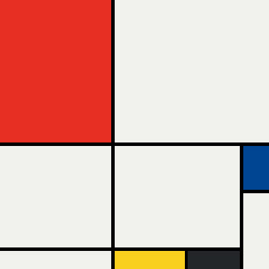

# Piet Mondrian in CSS

A visual recreation of Piet Mondrian's iconic abstract style using pure HTML and CSS Grid.

## Screenshot



## Features

- **Pure CSS Layout**: CSS Grid is used to recreate Mondrian's distinctive layout.
- **Animated Appearance**: Subtle fade-in effect for each grid block on load.
- **Interactive Hover**: Each block lights up when hovered, adding a touch of interactivity.
- **Responsive Design**: Layout adapts to screen sizes using CSS `clamp()`.

## Technologies Used

- **HTML5**: For structure and semantic layout.
- **CSS3**: For grid layout, animations, and responsive design.

## Getting Started

1. **Clone the Repository**:
   ```bash
   git clone https://github.com/dcmalk/piet-grid.git
   cd piet-grid
   ```
2. **Open `index.html` in a Browser**:
   Simply open the `index.html` file in your browser to view the project.
